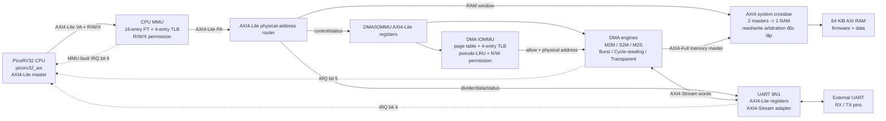

# PicoRV32 + DMA/IOMMU + UART SoC

## Kiến trúc được dùng



Hai miền dịch địa chỉ được tách độc lập. `picorv32_cpu_mmu` bảo vệ truy cập do
CPU phát ra; `dma_iommu_tlb` bảo vệ truy cập do DMA phát ra. CPU MMU dịch vùng
RAM, còn các cửa sổ MMIO DMA/UART được bypass bằng địa chỉ vật lý để firmware
luôn có thể cấu hình hệ thống. Chi tiết nằm trong `docs/CPU_SIDE_MMU.md`.

## Bản đồ địa chỉ CPU

| Khoảng địa chỉ | Khối | Giao tiếp |
|---|---|---|
| `0x0000_0000-0x0000_FFFF` | RAM 64 KiB | AXI4-Lite vào system crossbar |
| `0x1000_0000-0x1000_00FF` | DMA + IOMMU registers | AXI4-Lite |
| `0x2000_0000-0x2000_00FF` | UART registers | AXI4-Lite |
| `0x3000_0000-0x3000_00FF` | CPU MMU registers | AXI4-Lite, xử lý nội bộ trong CPU MMU |

UART là ngoại vi duy nhất. CPU có thể đọc/ghi byte qua thanh ghi UART; DMA nối
với cùng UART bằng AXI4-Stream để thực hiện memory-to-UART và UART-to-memory.

## Các file chính

| File | Chức năng |
|---|---|
| `src/SoC/dma_mmu_picorv32_soc.sv` | Top tổng thể CPU-DMA-IOMMU-UART-RAM |
| `src/PicoRV32/picorv32_axil_router.sv` | Giải mã ba vùng địa chỉ CPU |
| `src/PicoRV32/picorv32_cpu_mmu.sv` | Dịch VA CPU sang PA, TLB, quyền R/W/X và fault IRQ |
| `src/SoC/dma_mmu_axi_top.sv` | DMA/IOMMU IP đã thiết kế trước đó |
| `src/AXI/axil_to_apb_bridge.sv` | Cầu nối AXI4-Lite sang APB |
| `src/UART/uart_apb_axis.sv` | UART registers (chuẩn APB) và AXI4-Stream adapter |
| `src/UART/simpleuart_dma.sv` | UART 8N1 byte engine, có RX synchronizer |
| `firmware/build/soc_demo.hex` | Firmware chạy trực tiếp trên PicoRV32 |
| `testbench/tb_dma_mmu_picorv32_soc.sv` | Testbench tự kiểm tra |

## Kết quả self-check

Firmware phát `S`, cấu hình CPU MMU, kiểm tra ánh xạ không đồng nhất
`VA 0x8000 -> PA 0x3000`, rồi lập ánh xạ DMA IOMMU và chạy toàn bộ ma trận
DMA. Kết quả XSim hiện tại:

```text
[9512000] PASS CPU MMU: VA 0x00008000 -> PA 0x00003000,
          RAM=0xc0dec0de, TLB hits=14 misses=2
[100370000] PASS D01-D09: all firmware-driven DMA combinations verified
[184167000] PASS Q01: 8-entry descriptor FIFO/scatter-gather verified
[184574000] SOC TEST PASSED
```

Testbench AXI cấp IP trước đó vẫn dùng để tự kiểm tra đủ M2M, UART-to-memory,
memory-to-UART, ba chế độ truyền và trường hợp IOMMU từ chối quyền.

## Kết quả timing sau tối ưu

| Hạng mục | Kết quả post-route |
|---|---:|
| FPGA | `xc7a35tcpg236-1` |
| Clock đã kiểm chứng | 149.993 MHz (`6.667 ns`) |
| WNS / TNS | `+0.052 ns` / `0 ns` |
| Fmax suy ra từ route | khoảng 151.172 MHz |
| Slice LUT | 6,303 / 20,800 (30.30%) |
| Slice Register | 6,020 / 41,600 (14.47%) |
| BRAM tile | 16 / 50 (32%) |
| DSP | 0 / 90 |

Thiết kế đạt yêu cầu 150 MHz nhờ chia pipeline ở đường tra cứu TLB/page table
của CPU MMU và IOMMU, bước chuẩn bị AXI burst đọc/ghi và đường ALU/compare của
PicoRV32. Các thanh ghi pipeline chỉ tăng độ trễ khởi động vài chu kỳ; chiều
truyền, chế độ DMA, giao thức AXI, quyền bảo vệ và giá trị dữ liệu vẫn giữ
nguyên. Post-route đạt WNS `+0.052 ns`; Fmax suy ra từ critical path hiện tại là
khoảng 151.172 MHz.

## Mở bằng Vivado

Trong Vivado Tcl Console chạy:

```tcl
source C:/rtl/rtl/Project_Vivado/scripts/create_unified_project.tcl
```

Sau đó chọn **Run Simulation** để test CPU hoặc **Run Synthesis**. Muốn chạy
cả synthesis và implementation, source
`scripts/run_unified_implementation.tcl`. Chỉ thêm PACKAGE_PIN đúng với
bo mạch khi cần Generate Bitstream; không được đoán chân FPGA.
